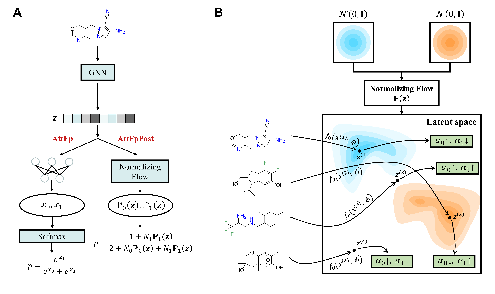

# Reducing Overconfident Errors in Molecular Property Classification using Posterior Network

This repository is the PyG implementation of "Reducing Overconfident Errors in Molecular Property Classification using Posterior Network", by Zhehuan Fan.😊

<p align="center">
   
</p>

## 🔔 News

[2024.06] The PyG implementation of AttFpPost is released!🎉

## 🔧 Environment Setup

We recommend using [mamba](https://github.com/mamba-org/mamba) to create a new environment and install the required packages.

```bash
mamba create -n postnet python==3.10
mamba activate postnet
mamba install pytorch==2.2.0 pytorch-cuda=11.8 -c pytorch -c nvidia
mamba install -c conda-forge lightning
mamba install -c conda-forge rdkit
mamba install pyg -c pyg
pip install pyro-ppl
pip install wandb
```

## 📄 Reproducing

If you want to reproduce the results presented in our paper, please refer to the original repository [here](https://github.com/HShokaku/AttFpPost)

## 📦 Datasets creation
### Dataset Folder Structure

Before creating the dataset, ensure you organize your data files according to the following folder structure:
```
data/
└── [dataset_name]/
    └── raw/
        ├── train.csv/
        ├── val.csv/
        └── test.csv/
```

Place your `train.csv`, `val.csv`, and `test.csv` files in `the data/[dataset_name]/raw/` directory and run the dataset creation script:

```bash
python create_dataset.py [dataset_name]
```

## 🚀 Training your own model

The training assumes that wandb is installed and that a wandb account is set up. To start a training run, execute
```bash
python train_model.py --dataset_name [dataset_name]
```

## Citation

If you find this repository useful in your research, please consider citing our paper 😊:

```
Fan et al., Reducing overconfident errors in molecular property classification using Posterior Network, Patterns (2024), 
doi:https://doi.org/10.1016/j.patter.2024.100991
```